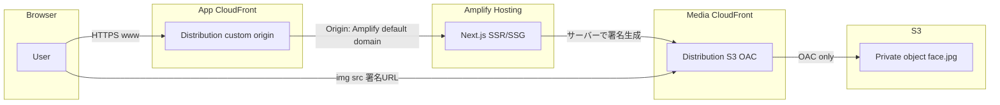

# S3 + CloudFront 署名 URL と前段 CloudFront のサンプル計画

## 前提（現状）

- リポジトリは [package.json](package.json) のとおり **Next.js 16.2 / React 19 / Tailwind 4** の初期テンプレートのみ。
- 実装の中心は [src/app/page.tsx](src/app/page.tsx) の差し替えと、サーバー側署名用の小さなモジュール追加。

---

## 「S3 + CloudFront」でセキュアになり得る理由（一次ソース）

AWS は「プライベートコンテンツ」を次の二層で説明している（[Serve private content with signed URLs and signed cookies](https://docs.aws.amazon.com/AmazonCloudFront/latest/DeveloperGuide/PrivateContent.html)）。

1. **エッジ（CloudFront キャッシュ）への制御**  
   信頼できるキーグループと紐づけた配信に対し、**署名付き URL または署名付き Cookie** を要求する。URL の一部は秘密鍵で署名され、CloudFront が「改ざんなし・期限内・（任意で）IP 制限など」を検証してからオブジェクトを返す（同ドキュメント「Restrict access to files in CloudFront caches」節）。

2. **オリジン（S3）へのバイパス防止（推奨）**  
   S3 を **OAC（Origin Access Control）** で CloudFront からのみ読めるようにし、**S3 の URL で直接読めない**ようにする。これにより「CloudFront の署名チェックをすり抜けて S3 に直アクセスする」経路を潰せる（同ドキュメント「Restrict access to files in Amazon S3 buckets」節、[Restrict access to an Amazon S3 origin](https://docs.aws.amazon.com/AmazonCloudFront/latest/DeveloperGuide/private-content-restricting-access-to-s3.html)）。

**注意（誤解しやすい点）:** 「キャッシュしているから絶対安全」ではない。**署名付き URL が有効な間に URL が漏れた場合、その URL では取得可能**（期限・IP 制限でリスクを下げる）。キャッシュは主に **レイテンシとオリジン負荷** に効く。機密性は **非公開バケット + OAC + 署名 + 短め TTL** の組み合わせで説明するのが AWS の意図に沿う。

---

## アーキテクチャ方針（サンプルとして分かりやすく二系統）

- **メディア用 CloudFront**（S3 オリジン + OAC + 該当ビヘイビアで署名必須）: 顔写真のみ。
- **アプリ前段 CloudFront**（カスタムオリジン = Amplify が出すオリジン URL）: Next.js。ユーザー向けドメインはこちらに付ける想定。

※ Amplify ホスティング自体も裏で CDN を使うが、要件どおり **手前に別 CloudFront** を置く構成とする（オリジンに Amplify の **デフォルトドメイン** を指定するパターン。詳細は [Origin settings](https://docs.aws.amazon.com/AmazonCloudFront/latest/DeveloperGuide/DownloadDistValuesOrigin.html) および Amplify のドメイン表示に従う）。

---

## アプリ実装方針（DB なし・1 画面・Tailwind）

| 項目         | 方針                                                                                                                                                                                                                                                                                                                                                                      |
| ------------ | ------------------------------------------------------------------------------------------------------------------------------------------------------------------------------------------------------------------------------------------------------------------------------------------------------------------------------------------------------------------------- |
| 画面         | [src/app/page.tsx](src/app/page.tsx) を **ユーザー詳細カード 1 枚**（氏名・メール等の固定モック + 顔写真）に変更。ダーク寄りのカード UI、タイポ・余白・レスポンシブで Tailwind 4 のユーティリティ中心。                                                                                                                                                                   |
| データ       | `src/data/mockUser.ts` などに固定オブジェクト（`photoObjectKey` のみ保持。URL はクライアントに生の S3 を出さない）。                                                                                                                                                                                                                                                      |
| 署名         | **Server Component** 内で `@aws-sdk/cloudfront-signer` の `getSignedUrl`（公式コード例への入口: [Code examples for creating a signature](https://docs.aws.amazon.com/AmazonCloudFront/latest/DeveloperGuide/PrivateCFSignatureCodeAndExamples.html)）を呼び、`photoUrl` を props として `` に渡す。**秘密鍵はサーバーのみ**（Amplify の環境変数 / SSR ランタイム）。 |
| `next/image` | 署名クエリが毎回変わる・最適化レイヤとの相性を避け、**通常の `` + `width/height` または `fill` 相当のラッパ**で十分（サンプル優先）。                                                                                                                                                                                                                                |
| 設定         | [next.config.ts](next.config.ts) は現状のままでよい（外部画像ドメインを使わないため）。                                                                                                                                                                                                                                                                                   |
| メタデータ   | [src/app/layout.tsx](src/app/layout.tsx) の `title` / `description` をサンプル用に更新。                                                                                                                                                                                                                                                                                  |

**必要な依存関係（実装フェーズで追加）:** `@aws-sdk/cloudfront-signer`（および型安全な env 読み取りに既存方針があれば合わせる。`as any` は使わない）。

**ローカル開発:** 署名用の `CLOUDFRONT_KEY_PAIR_ID` / `CLOUDFRONT_PRIVATE_KEY`（PEM）/ `CLOUDFRONT_MEDIA_DOMAIN`（例: `d1234567890.cloudfront.net`）をサーバー環境に渡す。鍵ファイルはリポジトリに含めない（手順書に「Amplify のシークレット環境変数に PEM 全文を入れる際の改行の扱い」を明記）。

---

## 手動インフラ手順書（実装フェーズで `docs/infra-manual.md` などに落とす想定）

以下を **コンソールまたは IaC なしの CLI** で順に実施する前提のチェックリストとする。

### A. メディア（顔写真）

1. **S3 バケット**作成（パブリックアクセスブロックオン、バージョニングは任意）。
2. テスト用の顔写真をアップロード（例: `users/demo/face.jpg`）。**バケットポリシーはまだ最小**でよい。
3. **CloudFront ディストリビューション** 新規
   - オリジン: 上記バケット。
   - **OAC 作成・アタッチ**（手順: [Restrict access to an Amazon S3 origin](https://docs.aws.amazon.com/AmazonCloudFront/latest/DeveloperGuide/private-content-restricting-access-to-s3.html)）。
   - S3 バケットポリシーを、**そのディストリビューションからの `s3:GetObject` のみ**に更新。
4. **キーペア**（RSA 2048 または ECDSA 256）を生成し、**公開鍵を CloudFront のキーグループ**に登録（[Specify signers](https://docs.aws.amazon.com/AmazonCloudFront/latest/DeveloperGuide/private-content-trusted-signers.html)）。秘密鍵はアプリ署名用として保管。
5. 対象の **キャッシュビヘイビア** にキーグループを関連付け、**署名付き URL / Cookie を必須**にする（オブジェクト単位で公開したくないパスに限定）。
6. **キャッシュ TTL** はサンプルなら短め（例: 数分〜数十分）で「署名の意図」と整合させる説明を手順書に書く。

### B. Next.js on Amplify

1. Amplify で **Git 連携ホスティング**（Gen1/Gen2 のどちらでもよいが、コンソール上の「ビルド設定」「SSR」表示に従う）を作成し、このリポジトリを接続。
2. ビルドコマンドは既存の `pnpm` ロックに合わせて **install + build**（Amplify のビルドイメージで `pnpm` が使える設定）。
3. 環境変数に `CLOUDFRONT_KEY_PAIR_ID`, `CLOUDFRONT_PRIVATE_KEY`, `CLOUDFRONT_MEDIA_DOMAIN`（またはベース URL）を設定。**秘密鍵はシークレット扱い**。

### C. アプリ前段の CloudFront（Amplify の「前」）

1. 新規ディストリビューション、**オリジン = Amplify が表示するアプリ URL**（例: `main.xxxxx.amplifyapp.com`）。プロトコル **HTTPS only**。
2. **Origin の Host ヘッダー**を Amplify のホスト名に合わせる（カスタムオリジンでホストヘッダーをオリジンドメインに設定するのが一般的。設定項目は [Origin settings](https://docs.aws.amazon.com/AmazonCloudFront/latest/DeveloperGuide/DownloadDistValuesOrigin.html) を参照）。
3. **デフォルトルートオブジェクトは不要**（SSR の `/` はオリジンに委譲）。必要なら `/` へのビヘイビアを確認。
4. **ACM 証明書**（us-east-1 でカスタムドメインを付ける場合）をアタッチし、**代替ドメイン名（CNAME）** を設定。
5. Route 53（または利用中 DNS）で **ユーザー向けドメインの A/AAAA（Alias to CloudFront）** を張る。
6. **（任意）** WAF をこのディストリビューションに関連付け、レート制限など。

### D. 動作確認

1. メディア URL を **署名なし** で開き **403** になること。
2. アプリから返る **署名付き URL** で画像が表示されること。
3. 期限切れ後に **403** になること。
4. S3 のオブジェクト URL を直接叩き **アクセス拒否** になること（OAC 設定済みの場合）。

---

## リスク・サンプル範囲の明示

- 本サンプルは **認証 IdP 連携（Cognito 等）は含めない**。「誰に署名 URL を渡すか」は **ページを開いた全員** に近い動きになるため、本番では **ログイン済みユーザーのみ** が Server Component / Route Handler に到達するようガードする必要がある（これは AWS ドキュメント外の一般的アプリ設計）。
- **PII（顔写真）** を扱う実運用では、ログ・ブラウザ履歴・Referer・CDN ログに URL が残らないようポリシー設計が別途必要（手順書に一文注意として記載）。

---

## 承認後の作業順（実装フェーズ用 TODO）

1. モックデータ + UI（1 画面）の実装。
2. CloudFront 署名 URL 生成ユーティリティ + 環境変数の型安全な読み取り。
3. 手順書 Markdown の追加（ユーザー指示があればファイル名を確定。なければ `docs/infra-manual.md` を提案）。
